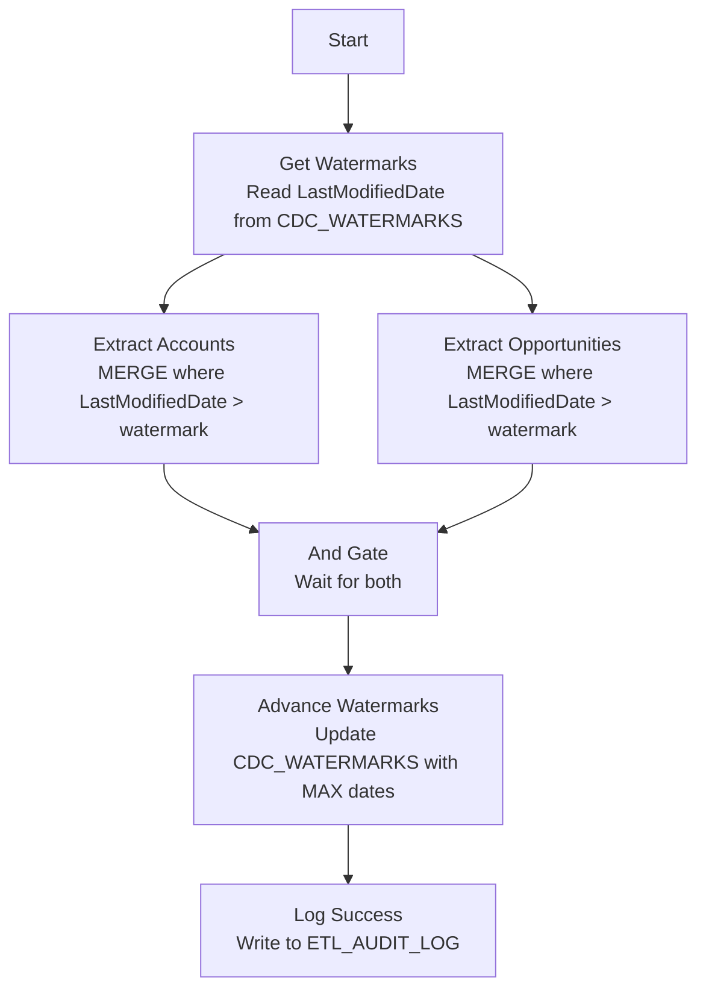

# Salesforce Incremental CDC Pipeline

## What Does This Pipeline Do?

This pipeline pulls customer and deal data from Salesforce into Snowflake. But here's the thing — Salesforce can have millions of records. You don't want to re-download everything every time. So this pipeline only grabs records that have been created or modified since the last run.

It tracks two Salesforce objects:
- **Accounts** (companies/customers)
- **Opportunities** (sales deals)

Each one has its own watermark, and they're extracted in parallel for speed.

## Real-World Use Case

A sales analytics team wants to build dashboards combining Salesforce CRM data with internal warehouse data. They need:
- Near-real-time account information (industry, type, billing country)
- Opportunity pipeline data (stage, amount, close date)
- Historical tracking of changes (when was this record last modified?)

This pipeline runs every hour, pulling only changed records, so the Snowflake tables stay fresh without hammering the Salesforce API.

## Prerequisites

1. **Snowflake database** with a `SALESFORCE` schema
2. **Salesforce API access** (connected app with OAuth or username/password)
3. **These tables created:**
   - `RAW_ACCOUNTS` — raw Salesforce Account data (source of truth)
   - `RAW_OPPORTUNITIES` — raw Salesforce Opportunity data
   - `STG_ACCOUNTS` — staging/target for processed Accounts
   - `STG_OPPORTUNITIES` — staging/target for processed Opportunities
   - `CDC_WATERMARKS` — tracks LastModifiedDate per entity
   - `ETL_AUDIT_LOG` — run history for observability
4. **Project variables:**
   - `v_database` — Snowflake database name

## Core Concept: What is CDC?

CDC stands for **Change Data Capture**. It's a pattern where you only extract records that have changed since your last extraction. There are several ways to implement CDC:

| Method | How It Works | Pros | Cons |
|--------|-------------|------|------|
| **Timestamp-based** (this pipeline) | Filter by `LastModifiedDate > watermark` | Simple, works with any source | Can miss deletes |
| **Log-based** | Read database transaction logs | Captures everything including deletes | Complex setup, source-specific |
| **Trigger-based** | Database triggers write to change table | Real-time | Adds overhead to source system |
| **Full comparison** | Compare entire datasets each run | Catches everything | Expensive for large tables |

We use **timestamp-based CDC** because Salesforce exposes `LastModifiedDate` on every object, making it the natural choice.

## How It Works — Step by Step

### Step 1: Get Watermarks

The pipeline reads the `CDC_WATERMARKS` table to find out: "What was the last `LastModifiedDate` I successfully processed for Accounts? And for Opportunities?"

These values get stored in pipeline variables:
- `v_hwm_accounts` = e.g., `2024-03-15T14:30:00.000Z`
- `v_hwm_opportunities` = e.g., `2024-03-15T12:00:00.000Z`

If it's the first run, the default is `2000-01-01` (get everything).

### Step 2: Extract Accounts (parallel branch 1)

Queries Salesforce (or a raw staging table) for all Account records where `LastModifiedDate` is greater than the watermark.

The extraction uses a **MERGE** into the staging table:
- If the Account ID already exists → UPDATE it with new values
- If it's a brand new Account → INSERT it

This means `STG_ACCOUNTS` always reflects the latest state of every account.

**Audit columns added:**
- `_ETL_LOADED_AT` — when the record was first loaded
- `_ETL_UPDATED_AT` — when the record was last refreshed

### Step 3: Extract Opportunities (parallel branch 2)

Same logic as Accounts, but for the Opportunity object. Runs at the same time as Accounts (parallel execution = faster).

Fields captured: Id, Name, StageName (e.g., "Closed Won"), Amount, CloseDate, AccountId (FK back to Accounts), LastModifiedDate.

### Step 4: And Gate (Wait for Both)

The And component waits for BOTH extractions to complete before moving forward. This ensures we don't advance watermarks until all data is safely loaded.

### Step 5: Advance Watermarks

For each entity, we find the MAX(`LastModifiedDate`) in the staging table and update `CDC_WATERMARKS` to that value.

The MERGE has a `HAVING COUNT(*) > 0` clause — meaning if an entity had zero new records (nothing changed since last run), its watermark stays put. No harm done.

### Step 6: Log Success

Inserts a row into `ETL_AUDIT_LOG` recording that the pipeline completed. This gives you an observability trail:
- When did it run?
- Did it succeed?
- How long did it take? (inferred from timestamps)

## Pipeline Flow



## Key Concepts Explained

### High Watermark Pattern

A "watermark" is simply a saved position marker. Think of it like this:

```
Timeline:  ---|------|------|------|------|--->
                ^                    ^
                |                    |
          Last watermark      New records start here
                |                    |
                +--------------------+
                  This is what we extract
```

After a successful run, the watermark moves forward to the newest record's timestamp. Next run, we start from there.

### Why MERGE Instead of INSERT?

If you just INSERT, and the same Account gets modified twice between runs, you'd have duplicates. MERGE checks the primary key first:

```
Source (new data):     Account 001 — Name: "Acme Corp" (modified today)
Target (existing):     Account 001 — Name: "Acme" (loaded yesterday)

MERGE result:          Account 001 — Name: "Acme Corp" (UPDATED, not duplicated)
```

### Why Separate Watermarks Per Entity?

Accounts and Opportunities change at different rates. Maybe Opportunities get updated 100 times/hour during sales season, but Accounts only change a few times/day. Separate watermarks mean each entity gets exactly the data it needs without over-fetching.

### What Are Audit Columns?

`_ETL_LOADED_AT` and `_ETL_UPDATED_AT` are metadata columns that track:
- When was this row first created in Snowflake?
- When was it last refreshed?

These are invaluable for debugging: "Hey, this account shows old data" — check `_ETL_UPDATED_AT` to see when it was last touched.

## How to Extend This Pipeline

Want to add a new Salesforce object (e.g., Contacts)?

1. Add a `v_hwm_contacts` pipeline variable
2. Add a new "Extract Contacts" SQL Executor (copy the Accounts pattern)
3. Connect it: `Get Watermarks → Extract Contacts` and `Extract Contacts → And`
4. Add a watermark MERGE for Contacts in "Advance Watermarks"
5. The And gate automatically waits for the new branch (no config change needed)

## Troubleshooting

| Symptom | Cause | Fix |
|---------|-------|-----|
| Same records extracted every run | Watermark not advancing | Check `CDC_WATERMARKS` table — is HIGH_WATERMARK updating? |
| Missing records | Watermark jumped too far | Check if source deletes and re-inserts records (use log-based CDC instead) |
| Pipeline runs but 0 rows | Nothing changed since last run | This is normal! The HAVING clause prevents unnecessary updates |
| Duplicate rows in staging | MERGE key is wrong | Ensure you're matching on the Salesforce `Id` field (globally unique) |
| And gate never fires | One branch errored | Check both Extract components for connection/auth issues |

## Table Schemas

```sql
-- Staging/target for Accounts
CREATE TABLE SALESFORCE.STG_ACCOUNTS (
    ID STRING PRIMARY KEY,
    NAME STRING,
    INDUSTRY STRING,
    TYPE STRING,
    BILLING_COUNTRY STRING,
    LAST_MODIFIED_DATE TIMESTAMP_TZ,
    _ETL_LOADED_AT TIMESTAMP DEFAULT CURRENT_TIMESTAMP(),
    _ETL_UPDATED_AT TIMESTAMP
);

-- Staging/target for Opportunities
CREATE TABLE SALESFORCE.STG_OPPORTUNITIES (
    ID STRING PRIMARY KEY,
    NAME STRING,
    STAGE_NAME STRING,
    AMOUNT NUMBER(18,2),
    CLOSE_DATE DATE,
    ACCOUNT_ID STRING,
    LAST_MODIFIED_DATE TIMESTAMP_TZ,
    _ETL_LOADED_AT TIMESTAMP DEFAULT CURRENT_TIMESTAMP(),
    _ETL_UPDATED_AT TIMESTAMP
);

-- Watermark tracking
CREATE TABLE SALESFORCE.CDC_WATERMARKS (
    PIPELINE_NAME STRING,
    ENTITY STRING,
    HIGH_WATERMARK TIMESTAMP_TZ,
    UPDATED_AT TIMESTAMP,
    PRIMARY KEY (PIPELINE_NAME, ENTITY)
);

-- Audit trail
CREATE TABLE SALESFORCE.ETL_AUDIT_LOG (
    PIPELINE_NAME STRING,
    STATUS STRING,
    COMPLETED_AT TIMESTAMP,
    MESSAGE STRING
);
```
